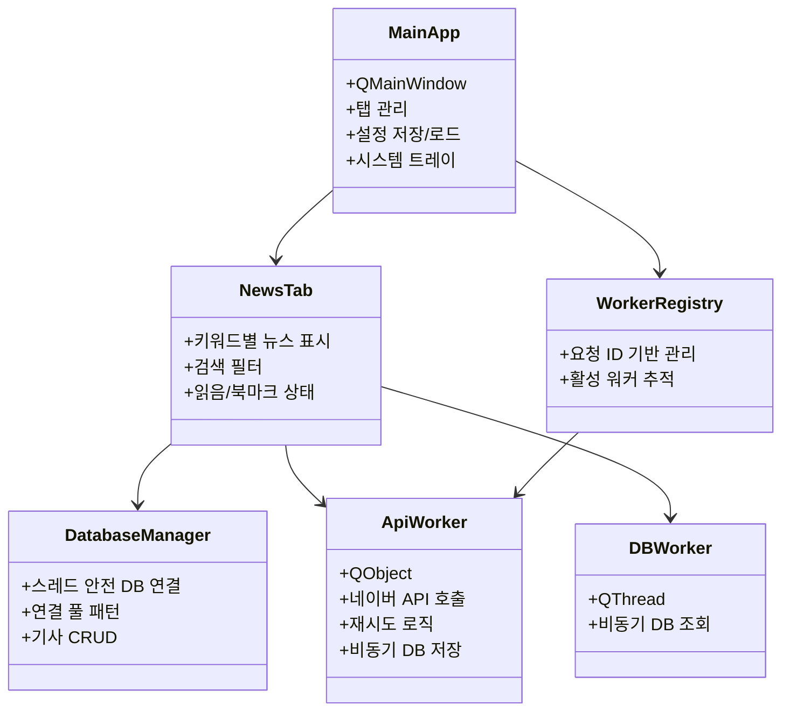

# AI Assistant Guidelines - 뉴스 스크래퍼 Pro

> 이 문서는 Gemini AI를 위한 프로젝트 가이드라인입니다.

## 📋 프로젝트 개요

| 항목 | 값 |
|------|-----|
| **프로젝트명** | 뉴스 스크래퍼 Pro |
| **버전** | v32.7.1 |
| **언어** | Python 3.8+ |
| **GUI 프레임워크** | PyQt6 |
| **주요 기능** | 네이버 뉴스 API 기반 탭 브라우징 뉴스 스크래퍼 |

---

## 🏗️ 아키텍처

### 파일 구조
```
navernews-tabsearch/
├── news_scraper_pro.py          # 엔트리포인트 + 호환 re-export 레이어
├── news_scraper_pro.spec        # PyInstaller 빌드 설정
├── core/                        # 코어 로직 패키지
│   ├── __init__.py
│   ├── bootstrap.py             # 앱 부팅(main), 전역 예외 처리, 단일 인스턴스 가드
│   ├── constants.py             # 경로/버전/앱 상수
│   ├── config_store.py          # 설정 스키마 정규화 + 원자 저장
│   ├── database.py              # DatabaseManager (연결 풀, CRUD)
│   ├── workers.py               # ApiWorker/DBWorker/AsyncJobWorker
│   ├── worker_registry.py       # WorkerHandle/WorkerRegistry
│   ├── query_parser.py          # parse_tab_query/build_fetch_key
│   ├── backup.py                # AutoBackup/apply_pending_restore_if_any
│   ├── backup_guard.py          # 리팩토링 백업 유틸리티
│   ├── startup.py               # StartupManager (Windows 자동 시작 레지스트리)
│   ├── keyword_groups.py        # KeywordGroupManager
│   ├── logging_setup.py         # configure_logging
│   ├── notifications.py         # NotificationSound
│   ├── text_utils.py            # TextUtils, parse_date_string, perf_timer
│   └── validation.py            # ValidationUtils
├── ui/                          # UI 로직 패키지
│   ├── __init__.py
│   ├── main_window.py           # MainApp (메인 윈도우)
│   ├── news_tab.py              # NewsTab (개별 뉴스 탭)
│   ├── settings_dialog.py       # SettingsDialog
│   ├── dialogs.py               # NoteDialog/LogViewerDialog/KeywordGroupDialog/BackupDialog
│   ├── styles.py                # Colors/UIConstants/ToastType/AppStyle
│   ├── toast.py                 # ToastQueue/ToastMessage
│   └── widgets.py               # NewsBrowser/NoScrollComboBox
├── tests/                       # 회귀/호환성/안정성 테스트 (11개 모듈)
├── query_parser.py              # 호환 래퍼 (→ core.query_parser)
├── config_store.py              # 호환 래퍼 (→ core.config_store)
├── backup_manager.py            # 호환 래퍼 (→ core.backup)
├── worker_registry.py           # 호환 래퍼 (→ core.worker_registry)
├── workers.py                   # 호환 래퍼 (→ core.workers)
├── database_manager.py          # 호환 래퍼 (→ core.database)
├── styles.py                    # 호환 래퍼 (→ ui.styles)
├── news_scraper_config.json     # 사용자 설정 (API 키, 테마, 탭 목록)
├── news_database.db             # SQLite 데이터베이스 (기사, 북마크)
├── news_icon.ico                # 애플리케이션 아이콘
├── news_scraper.log             # 로그 파일
├── backups/                     # 백업 디렉터리
└── dist/                        # PyInstaller 빌드 결과물
```

### 핵심 클래스 계층



---

## 🎨 UI/UX 가이드라인

### 색상 시스템 (Colors 클래스)

라이트/다크 테마를 지원하며, Tailwind CSS 인디고 컬러 팔레트 기반:

| 용도 | 라이트 테마 | 다크 테마 |
|------|-------------|-----------|
| Primary | `#6366F1` (인디고 500) | `#818CF8` (인디고 400) |
| Success | `#10B981` (에메랄드 500) | `#34D399` (에메랄드 400) |
| Background | `#F8FAFC` (슬레이트 50) | `#0F172A` (슬레이트 900) |
| Card BG | `#FFFFFF` | `#1E293B` (슬레이트 800) |
| Text | `#1E293B` (슬레이트 800) | `#F1F5F9` (슬레이트 100) |

### UI 상수 (UIConstants)

```python
CARD_PADDING = "16px 20px"
BORDER_RADIUS = "10px"
ANIMATION_DURATION = 300  # ms
TOAST_DURATION = 2500     # ms
```

### 스타일시트 (AppStyle)

- `AppStyle.LIGHT`: 라이트 테마 QSS
- `AppStyle.DARK`: 다크 테마 QSS
- 현대화된 그라디언트, 라운드 코너, 미니멀 디자인 적용

---

## 💻 코드 컨벤션

### 명명 규칙

| 구분 | 규칙 | 예시 |
|------|------|------|
| 클래스 | PascalCase | `DatabaseManager`, `NewsTab` |
| 함수/메서드 | snake_case | `load_config()`, `get_articles()` |
| 상수 | UPPER_SNAKE_CASE | `CONFIG_FILE`, `DB_FILE` |
| 시그널 | snake_case | `search_finished`, `action_triggered` |

### 주요 패턴

1. **스레드 안전성**: `QMutex`, `QMutexLocker` 사용
2. **연결 풀 패턴**: `DatabaseManager`에서 SQLite 연결 관리
3. **시그널/슬롯**: PyQt6 표준 이벤트 처리
4. **LRU 캐시**: `@lru_cache`로 정규식 패턴 캐싱

### 에러 처리

```python
try:
    # 작업 수행
except Exception as e:
    logger.error(f"오류 설명: {e}")
    # 사용자에게 토스트 메시지로 알림
    self.toast_queue.add(f"오류: {str(e)}", ToastType.ERROR)
```

---

## 📊 데이터베이스 스키마

### articles 테이블

| 컬럼 | 타입 | 설명 |
|------|------|------|
| id | INTEGER | Primary Key, Auto-increment |
| keyword | TEXT | 검색 키워드 |
| title | TEXT | 기사 제목 |
| link | TEXT | 원본 링크 |
| originallink | TEXT | 네이버 뉴스 링크 |
| description | TEXT | 기사 요약 |
| pubDate | TEXT | 게시 일시 |
| pubDate_ts | REAL | 정렬용 타임스탬프 |
| publisher | TEXT | 언론사 |
| link_hash | TEXT | 링크 해시 (중복 체크) |
| is_read | INTEGER | 읽음 상태 (0/1) |
| is_bookmarked | INTEGER | 북마크 상태 (0/1) |
| memo | TEXT | 사용자 메모 |
| created_at | TEXT | 생성 일시 |

---

## 🔌 외부 API

### 네이버 검색 API

```python
# 엔드포인트
NAVER_API_URL = "https://openapi.naver.com/v1/search/news.json"

# 필수 헤더
headers = {
    "X-Naver-Client-Id": client_id,
    "X-Naver-Client-Secret": client_secret
}

# 요청 파라미터
params = {
    "query": keyword,
    "display": 100,      # 최대 100개
    "sort": "date",      # 최신순
    "start": 1           # 시작 인덱스
}
```

---

## ⚠️ 수정 시 주의사항

### 하지 말아야 할 것

1. **`news_scraper_pro.py` 직접 수정 금지**: `news_scraper_pro.py`는 thin entrypoint + re-export 레이어. 새 로직은 반드시 `core/` 또는 `ui/`에 추가.
2. **HiDPI 설정 위치 변경 금지**: PyQt6 import 전에 환경변수 설정 필요
3. **DB 스키마 변경 시 마이그레이션 필요**: 기존 사용자 데이터 보존
4. **색상 하드코딩 금지**: `ui/styles.py`의 `Colors` 클래스 사용 권장

### 해야 할 것

1. **로깅 사용**: 모든 중요 작업에 `logger.info()`, `logger.error()` 사용
2. **스레드 안전성 확보**: DB 작업은 반드시 `DatabaseManager` 경유
3. **PyInstaller 호환성**: `getattr(sys, 'frozen', False)` 체크
4. **타입 힌트 사용**: `typing` 모듈 활용
5. **새 모듈 추가 시 래퍼 고려**: `core/` 또는 `ui/`에 추가 후 필요시 루트 래퍼 생성

---

## 🧪 테스트 및 빌드

### 로컬 실행
```bash
pip install PyQt6 requests
python news_scraper_pro.py
```

### PyInstaller 빌드
```bash
pyinstaller news_scraper_pro.spec
```

### 디버깅 모드
```bash
python news_scraper_pro.py --debug
```

---

## 📝 기여 가이드

1. 변경 전 `update_history.md` 확인
2. 버전 번호 업데이트 (`VERSION` 상수)
3. README.md 동기화
4. 한국어 UI 텍스트 일관성 유지
5. UI 변경 시 라이트/다크 테마 모두 테스트

---

## 🧩 핵심 클래스 상세 가이드

### MainApp (메인 윈도우)

```python
class MainApp(QMainWindow):
    """메인 애플리케이션 윈도우"""
    
    # 주요 속성
    self.db                    # DatabaseManager 인스턴스
    self.toast_queue           # ToastQueue 알림 시스템
    self.workers               # Dict[str, ApiWorker] - 키워드별 워커
    self.timer                 # QTimer - 자동 새로고침
    self.tray                  # QSystemTrayIcon
    self.keyword_group_manager # KeywordGroupManager
    self.auto_backup           # AutoBackup
    
    # 새로고침 상태 추적
    self._refresh_in_progress  # bool
    self._sequential_refresh_active  # bool
    self._pending_refresh_keywords   # List[str]
```

### NewsTab (뉴스 탭 위젯)

```python
class NewsTab(QWidget):
    """개별 뉴스 탭"""
    
    # 렌더링 최적화 상수
    INITIAL_RENDER_COUNT = 50   # 초기 렌더링 개수
    LOAD_MORE_COUNT = 30        # 추가 로딩 개수
    MAX_RENDER_COUNT = 500      # 최대 렌더링 개수
    FILTER_DEBOUNCE_MS = 250    # 필터 디바운싱 시간
    
    # 주요 속성
    self.keyword             # str - 검색 키워드
    self.news_data_cache     # List[Dict] - 전체 뉴스 캐시
    self.filtered_data_cache # List[Dict] - 필터링된 캐시
    self._rendered_count     # int - 현재 렌더링된 항목 수
```

### DatabaseManager (DB 연결 관리)

```python
class DatabaseManager:
    """스레드 안전한 DB 매니저 (연결 풀 패턴)"""
    
    # 주요 메서드
    def get_connection(self) -> sqlite3.Connection
    def return_connection(self, conn)
    def fetch_news(keyword, filter_txt, sort_mode, ...) -> List[Dict]
    def upsert_news(items, keyword) -> Tuple[int, int]  # (added, duplicates)
    def update_status(link, field, value) -> bool
    def get_counts(keyword) -> int
    def mark_all_as_read(keyword, only_bookmark) -> int
```

---

## 📡 시그널/슬롯 패턴

### ApiWorker 시그널

```python
class ApiWorker(QObject):
    finished = pyqtSignal(dict)   # {'items': [...], 'added_count': n}
    error = pyqtSignal(str)       # 오류 메시지
    progress = pyqtSignal(str)    # 진행 상태 메시지
```

### DBWorker 시그널

```python
class DBWorker(QThread):
    finished = pyqtSignal(list, int)  # (data, total_count)
    error = pyqtSignal(str)           # 오류 메시지
```

### NewsBrowser 시그널

```python
class NewsBrowser(QTextBrowser):
    action_triggered = pyqtSignal(str, str)  # (action, link_hash)
    # action: 'bm', 'share', 'note', 'delete', 'ext', 'toggle_read'
```

---

## 🔗 내부 URL 스키마 (app://)

뉴스 브라우저에서 사용하는 커스텀 URL 스키마:

| URL 패턴 | 동작 |
|----------|------|
| `app://open/{hash}` | 뉴스 링크 열기 + 읽음 표시 |
| `app://bm/{hash}` | 북마크 토글 |
| `app://share/{hash}` | 제목+링크 클립보드 복사 |
| `app://note/{hash}` | 메모 다이얼로그 열기 |
| `app://ext/{hash}` | 외부 브라우저로 열기 |
| `app://unread/{hash}` | 안 읽음으로 표시 |
| `app://load_more` | 더 많은 항목 로드 |

---

## ⚡ 성능 최적화 기법

### 1. 렌더링 최적화 (Phase 3)

```python
# 초기 렌더링 시 제한된 항목만 표시
render_limit = min(self._rendered_count + self.INITIAL_RENDER_COUNT, 
                   self.MAX_RENDER_COUNT)

# "더 보기" 클릭 시 추가 로드
def append_items(self):
    self._rendered_count = min(start_idx + self.LOAD_MORE_COUNT, total_items)
    self.render_html()
```

### 2. 필터 디바운싱

```python
# 입력 변경 시 타이머 리셋 (불필요한 렌더링 방지)
self.filter_timer = QTimer(self)
self.filter_timer.setSingleShot(True)
self.filter_timer.timeout.connect(self._apply_filter_debounced)
self.inp_filter.textChanged.connect(self._on_filter_changed)

def _on_filter_changed(self):
    self.filter_timer.stop()
    self.filter_timer.start(self.FILTER_DEBOUNCE_MS)  # 250ms
```

### 3. HTTP 세션 풀링

```python
# 공유 세션으로 연결 재사용
adapter = HTTPAdapter(pool_connections=20, pool_maxsize=20, max_retries=3)
session.mount('https://', adapter)
```

### 4. LRU 캐시 활용

```python
@lru_cache(maxsize=128)
def get_highlight_pattern(keyword: str) -> re.Pattern:
    return re.compile(f'({re.escape(keyword)})', re.IGNORECASE)
```

---

## ⌨️ 단축키 목록

| 단축키 | 동작 | 구현 위치 |
|--------|------|-----------|
| `Ctrl+R` / `F5` | 모든 탭 새로고침 | `setup_shortcuts()` |
| `Ctrl+T` | 새 탭 추가 | `setup_shortcuts()` |
| `Ctrl+W` | 현재 탭 닫기 | `setup_shortcuts()` |
| `Ctrl+F` | 필터 입력창 포커스 | `setup_shortcuts()` |
| `Ctrl+S` | CSV 내보내기 | `setup_shortcuts()` |
| `Ctrl+,` | 설정 다이얼로그 | `setup_shortcuts()` |
| `Alt+1~9` | 탭 바로가기 | `setup_shortcuts()` |

---

## 🔔 알림 시스템

### ToastQueue 사용법

```python
# 성공 알림
self.toast_queue.add("저장 완료!", ToastType.SUCCESS)

# 오류 알림
self.toast_queue.add(f"API 오류: {error}", ToastType.ERROR)

# 경고 알림
self.toast_queue.add("API 키를 확인하세요", ToastType.WARNING)

# 정보 알림 (기본값)
self.toast_queue.add("새 기사 10건 발견")
```

### 시스템 트레이 알림

```python
self.show_tray_notification(
    title="새 뉴스",
    message="10개의 새로운 기사가 도착했습니다",
    icon_type=QSystemTrayIcon.MessageIcon.Information
)
```

---

## 💾 백업 시스템

### AutoBackup 클래스

```python
class AutoBackup:
    BACKUP_DIR = "backups"
    MAX_BACKUPS = 5  # 최대 보관 수
    
    def create_backup(include_db: bool = True) -> Optional[str]
    def get_backup_list() -> List[Dict]
    def restore_backup(backup_name: str, restore_db: bool = True) -> bool
```

### 백업 폴더 구조

```
backups/
├── backup_20260114_224500/
│   ├── backup_info.json
│   ├── news_scraper_config.json
│   └── news_database.db (선택적)
└── backup_20260113_183000/
    └── ...
```

---

## 🖥️ 시스템 트레이 통합

### 트레이 기능

- 최소화 시 트레이로 숨김 (`minimize_to_tray`)
- 닫기 버튼 클릭 시 트레이로 (`close_to_tray`)
- 더블클릭으로 창 복원
- 컨텍스트 메뉴: 열기, 새로고침, 설정, 종료
- 읽지 않은 기사 수 툴팁 표시

### Windows 자동 시작

```python
class StartupManager:
    REGISTRY_KEY = r"SOFTWARE\Microsoft\Windows\CurrentVersion\Run"
    
    @classmethod
    def enable_startup(cls, start_minimized: bool = False) -> bool
    
    @classmethod
    def disable_startup(cls) -> bool
```

---

## 🧪 테스트 가이드

### 수동 테스트 체크리스트

1. **API 연동**
   - 네이버 API 키 입력 후 검색 동작 확인
   - 잘못된 API 키로 오류 메시지 확인
   
2. **탭 기능**
   - 새 탭 추가/삭제
   - 탭 이름 변경 (더블클릭)
   - 탭 순서 변경 (드래그)

3. **필터링**
   - 제목/내용 필터 동작
   - 날짜 범위 필터
   - "안 읽은 것만" 체크박스

4. **북마크/메모**
   - 북마크 추가/해제
   - 메모 작성/수정/삭제
   - 북마크 탭에서 확인

5. **시스템 통합**
   - 트레이로 최소화
   - 트레이에서 복원
   - 알림 표시

---

## 🔗 관련 파일

- [README.md](README.md) - 사용자 가이드
- [update_history.md](update_history.md) - 업데이트 내역
- [news_scraper_pro.spec](news_scraper_pro.spec) - PyInstaller 설정
- [claude.md](claude.md) - Claude AI 지침서


## v32.7.0 → v32.7.1 Module Split Summary

### Runtime Structure
- `news_scraper_pro.py`: thin entrypoint + compatibility re-exports.
- `core/`: non-UI runtime modules (16개 파일).
- `ui/`: UI-specific classes and dialogs (8개 파일).
- Root wrappers: `query_parser.py`, `config_store.py`, `backup_manager.py`, `worker_registry.py`, `workers.py`, `database_manager.py`, `styles.py`

### v32.7.1 추가 변경사항
- 단일 인스턴스 가드 (`QLockFile`) 추가
- `sound_enabled`, `api_timeout` 설정 플러밍 보완
- 설정 창 API 키 검증/데이터 정리 비동기 처리
- 설정 가져오기 탭 중복 병합(dedupe) 강화

### Migration Rules
- Preserve public import paths for existing scripts/tests.
- Root modules remain as wrappers for backward compatibility.
- Any new implementation should be added under `core/` or `ui/`, not into `news_scraper_pro.py`.

