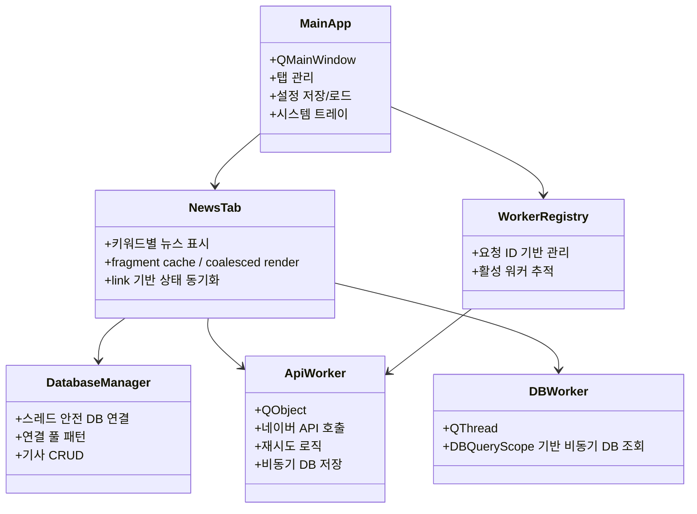

# AI Assistant Guidelines - 뉴스 스크래퍼 Pro

> 이 문서는 Gemini AI를 위한 프로젝트 가이드라인입니다.

## 📋 프로젝트 개요

| 항목 | 값 |
|------|-----|
| **프로젝트명** | 뉴스 스크래퍼 Pro |
| **버전** | v32.7.3 |
| **언어** | Python 3.10+ (개발/검증 기준 3.14) |
| **GUI 프레임워크** | PyQt6 |
| **주요 기능** | 네이버 뉴스 API 기반 탭 브라우징 뉴스 스크래퍼 |
| **정적 분석** | Pyright / Pylance |

---

## 🏗️ 아키텍처

### 파일 구조
```
navernews-tabsearch/
├── news_scraper_pro.py          # 엔트리포인트 + 호환 re-export 레이어
├── news_scraper_pro.spec        # PyInstaller 빌드 설정
├── pyrightconfig.json           # Pyright/Pylance 기준 설정
├── pytest.ini                   # pytest 진입점/수집 경로 고정
├── core/                        # 코어 로직 패키지
│   ├── __init__.py
│   ├── bootstrap.py             # 앱 부팅(main), 전역 예외 처리, 단일 인스턴스 가드
│   ├── constants.py             # 경로/버전/앱 상수
│   ├── config_store.py          # 설정 스키마 정규화 + 원자 저장/.backup 회전
│   ├── database.py              # DatabaseManager facade (연결 풀 수명 주기)
│   ├── http_client.py           # 중앙 HTTP 구성 + worker-owned requests.Session factory
│   ├── _db_schema.py            # 스키마 초기화 / 무결성 검사 / 복구
│   ├── _db_duplicates.py        # 제목 해시 / 중복 플래그 재계산
│   ├── _db_queries.py           # 조회 / 개수 / 미읽음 집계
│   ├── _db_mutations.py         # upsert / 상태 변경 / 삭제 / 읽음 처리
│   ├── _db_analytics.py         # 통계 / 언론사 분석
│   ├── protocols.py             # lock/session capability Protocol
│   ├── workers.py               # ApiWorker/DBWorker/AsyncJobWorker/IterativeJobWorker/InterruptibleReadWorker/DBQueryScope
│   ├── worker_registry.py       # WorkerHandle/WorkerRegistry
│   ├── query_parser.py          # parse_tab_query/parse_search_query/build_fetch_key
│   ├── backup.py                # AutoBackup/on-demand backup verification/apply_pending_restore_if_any
│   ├── backup_guard.py          # 리팩토링 백업 유틸리티
│   ├── startup.py               # StartupManager/StartupStatus (Windows 자동 시작 상태/레지스트리)
│   ├── keyword_groups.py        # KeywordGroupManager
│   ├── logging_setup.py         # configure_logging
│   ├── notifications.py         # NotificationSound
│   ├── text_utils.py            # TextUtils, parse_date_string, perf_timer
│   └── validation.py            # ValidationUtils
├── ui/                          # UI 로직 패키지
│   ├── __init__.py
│   ├── main_window.py           # MainApp facade / composition root
│   ├── _main_window_tabs.py     # 탭 추가/닫기/리네임/그룹 연결
│   ├── _main_window_fetch.py    # fetch orchestration / worker 수명 주기
│   ├── _main_window_settings_io.py # 설정 import/export / 유지보수 동기화
│   ├── _main_window_tray.py     # 트레이 / 종료 / closeEvent 처리
│   ├── _main_window_analysis.py # 통계 / 분석 UI
│   ├── news_tab.py              # NewsTab (개별 뉴스 탭, fragment cache + coalesced render)
│   ├── dialog_adapters.py       # QFileDialog/QMessageBox adapter
│   ├── protocols.py             # 메인 윈도우/부모 capability Protocol
│   ├── settings_dialog.py       # SettingsDialog facade
│   ├── _settings_dialog_content.py # 설정/도움말/단축키 탭 조립
│   ├── _settings_dialog_docs.py # 도움말 / 단축키 HTML
│   ├── _settings_dialog_tasks.py # API 검증 / 데이터 정리 / 워커 정리
│   ├── dialogs.py               # NoteDialog/LogViewerDialog/KeywordGroupDialog/BackupDialog
│   ├── styles.py                # Colors/UIConstants/ToastType/AppStyle
│   ├── toast.py                 # ToastQueue/ToastMessage
│   └── widgets.py               # NewsBrowser/NoScrollComboBox
├── tests/                       # 회귀/호환성/안정성 테스트 (최신 목록은 tests/ 디렉터리 기준)
├── query_parser.py              # 호환 래퍼 (→ core.query_parser)
├── config_store.py              # 호환 래퍼 (→ core.config_store)
├── backup_manager.py            # 호환 래퍼 (→ core.backup)
├── worker_registry.py           # 호환 래퍼 (→ core.worker_registry)
├── workers.py                   # 호환 래퍼 (→ core.workers)
├── database_manager.py          # 호환 래퍼 (→ core.database)
├── styles.py                    # 호환 래퍼 (→ ui.styles)
├── news_scraper_config.json     # 사용자 설정 (API 키, 테마, 탭 목록, pagination_state)
├── news_database.db             # SQLite 데이터베이스 (기사, 북마크)
├── news_icon.ico                # 애플리케이션 아이콘
├── news_scraper.log             # 로그 파일
├── backups/                     # 백업 디렉터리
└── dist/                        # PyInstaller 빌드 결과물
```

### 현재 검증 기준

- `python -m pytest -q` => `228 passed, 5 subtests passed`
- `pyright` => 로컬 환경 기준 `74 errors, 5 warnings, 0 informations`
- 원인 메모: `PyQt6`/`requests` import source 미해결과 `core/bootstrap.py`, `ui/settings_dialog.py`, `ui/_settings_dialog_tasks.py`, 일부 테스트 더미의 optional/member 타입 이슈가 같이 남아 있다.
- `tests/test_encoding_smoke.py`가 저장소 주요 텍스트 자산의 UTF-8 decode/replacement-char/깨진 토큰/대표 mojibake 패턴 회귀를 감시
- `pyinstaller --noconfirm --clean news_scraper_pro.spec` 클린 빌드는 2026-04-16 기준 다시 성공했다.

### 2026-04-16 Follow-up Risk Fixes + Docs/Spec Revalidation

- `ApiWorker`는 `500/502/503/504` 등 `5xx`를 재시도 경로로 편입하고, 최종 실패 시 `retryable=True`인 `http_error` 메타를 유지한다.
- `NewsTab` 초기 hydration은 request-id 취소 + late cleanup으로 hardened 되었고, 시작 시 북마크/현재 탭만 즉시 로드하며 나머지 탭은 순차 hydration queue로 처리한다.
- 설정 import는 `stage -> persist -> apply-runtime -> startup reconcile` 순서로 재구성되어 부분 적용된 runtime 상태를 남기지 않는다.
- backup metadata는 legacy `include_db` 누락을 실제 payload 존재 여부로 보정하고, 수동 검증/복원 직전 검증은 `last_verified_at`을 포함한 verification 메타를 `backup_info.json`에 저장한다.
- `show_statistics()`와 `show_stats_analysis()`는 이제 `InterruptibleReadWorker` 기반 비동기 로드로 전환되었고, 다이얼로그 종료 시 SQLite read interruption을 요청한다.
- startup FTS backfill은 dedicated retry scheduler로 `5s -> 15s -> 30s cap` backoff를 사용하며 maintenance/fetch/shutdown 경계에서 pause/resume 된다.
- `news_scraper_pro.spec`와 `.gitignore`를 다시 검토했고, 이번 패스에서도 추가 packaging/ignore 수정은 필요하지 않았다.

### 2026-04-13 Implementation Risk Plan Closure

- `core.database.DatabaseWriteError`를 추가했고, `DatabaseManager.upsert_news(...)`는 DB write failure를 더 이상 `(0, 0)` 성공값으로 삼키지 않는다.
- `ApiWorker`는 DB 조회 실패와 저장 실패를 각각 error 경로로 올리며, fetch 성공 토스트/알림은 DB upsert 완료 후에만 발생한다.
- `core._db_schema.init_db()`는 `title_hash IS NULL`, `pubDate_ts IS NULL` backfill을 반복 배치 루프로 수행해 대용량 legacy DB에서도 startup migration 잔여분이 남지 않게 했다.
- 설정 창 API 키 검증은 이제 `HttpClientConfig` 기반 공용 session과 현재 `spn_api_timeout` 값을 사용하며, timeout/network/http failure를 구분해 사용자에게 보여준다.
- `tests/test_settings_validation_http_policy.py`를 추가했고, `tests/test_encoding_smoke.py`는 다중 suspicious token/패턴 회귀 검사로 강화됐다.
- `news_scraper_pro.spec`와 `.gitignore`를 다시 검토했고, 이번 패스에서는 추가 packaging/ignore 수정이 필요하지 않았다.

### 2026-04-09 Implementation Risk Audit Plan Completion

- `core.http_client.HttpClientConfig`를 추가해 `ApiWorker`가 중앙 HTTP 설정에서 worker-owned session을 생성한다.
- `ApiWorker.last_error_meta`와 `MainApp` 전역 fetch cooldown을 연결해 429/quota 성격 오류 후 수동/자동/순차 refresh 및 `더 불러오기`를 함께 제어한다.
- `DatabaseManager.iter_news_snapshot_batches(...)`가 CSV export를 단일 read snapshot 기준으로 고정하고, `DBWorker`는 dedicated read connection + `interrupt_connection(...)`으로 취소 가능성을 높인다.
- `show_statistics()`와 `show_stats_analysis()`는 `AsyncJobWorker` 기반 비동기 로드로 전환됐고, stale-result guard를 포함한다.
- SQLite FTS5(`news_fts`) + trigger + `app_meta` 기반 증분 backfill이 추가됐으며, backfill 완료 전 검색의 의미 보장은 기존 `LIKE/NOT LIKE` 경로가 맡는다.
- `README.md`, `claude.md`, `gemini.md`, `project_structure_analysis.md`, `update_history.md`, `news_scraper_pro.spec`를 위 계약에 맞춰 갱신했다.

### 2026-04-05 Implementation Risk Audit Full Adoption

- 유지보수 모드는 fetch뿐 아니라 탭 DB 재조회, 필터/정렬/기간 변경 reload, CSV export, 통계/분석, `모두 읽음`, import 후 선택 refresh까지 전역 DB 작업을 차단한다.
- `core.database.DatabaseQueryError`를 도입해 조회/집계 실패가 `[]`/`0`으로 숨지 않게 했고, `DBWorker`/`NewsTab`/분석 UI는 기존 캐시를 유지한 채 상태바/토스트/경고로 실패를 노출한다.
- `KeywordGroupManager.save_groups()`는 저장 실패를 더 이상 삼키지 않으며, `KeywordGroupDialog`는 실패 시 닫히지 않아 재시도 UX를 보장한다.
- `AutoBackup.create_backup()`는 생성 직후 self-verify를 수행하고, 실패한 백업은 삭제하지 않은 채 `복원 불가` 상태로 목록에 남긴다.
- import로 새로 추가된 탭의 즉시 새로고침 prompt는 실제 refresh 가능 조건을 통과한 경우에만 표시된다.
- `news_scraper_pro.spec`를 다시 검토했고, 이번 패스에서도 추가 packaging 변경은 필요하지 않았다.
- 검증:
  - `python -m pytest -q` => `196 passed, 5 subtests passed`
  - `pyright` => `0 errors, 0 warnings, 0 informations`
  - `pyinstaller --noconfirm --clean news_scraper_pro.spec` => success (`dist/NewsScraperPro_Safe.exe`)

### 2026-04-02 Implementation Audit Full Adoption

- `ui.dialog_adapters.QtDialogAdapter`를 추가해 CSV export, 설정 export/import, 백업 create/restore/delete에서 Qt static dialog 의존성을 분리했다.
- `MainApp._perform_real_close()`는 열린 `NewsTab` cleanup을 먼저 수행하고, `NewsTab.cleanup()`은 timer/DB worker/job worker/request state를 idempotent하게 정리한다.
- `AutoBackup.create_backup()`는 복원 가능한 payload preflight를 강제하며, 설정 파일이 없으면 manual backup은 실패하고 startup auto-backup은 조용히 skip한다.
- 설정 import는 새로 추가된 탭 목록을 추적하고, 필요 시 `refresh_selected_tabs(...)`로 해당 탭만 순차 새로고침한다.
- `news_scraper_pro.spec`와 `.gitignore`를 다시 검토했고, 이번 패스에서도 추가 packaging/ignore 변경은 필요하지 않았다.
- 검증:
  - `python -m pytest -q` => `196 passed, 5 subtests passed`
  - `pyinstaller --noconfirm --clean news_scraper_pro.spec` => success (`dist/NewsScraperPro_Safe.exe`)

### 2026-03-27 UI/UX Hardening + Docs/Packaging Revalidation

- `SettingsDialog`는 `help_mode` / `initial_tab`을 지원하며, 도움말은 저장과 분리된 read-only 다이얼로그로 열린다.
- `NewsTab`은 기간 필터를 `적용`/`해제`로 명시화했고, 외부 기사 열기 실패 시 읽음 처리하지 않으며, unread 수치를 DB scope 기준으로 유지한다.
- `MainApp`은 자동 새로고침 카운트다운을 전용 상태바 라벨로 분리했고, 트레이 미지원 환경에서도 데스크톱 fallback 알림을 사용한다.
- `KeywordGroupDialog`는 staged save/cancel 모델을 사용하고, `BackupDialog`의 무거운 검증은 사용자 트리거형으로 전환됐다.
- `news_scraper_pro.spec`와 `.gitignore`를 다시 검토했으며, 이번 패스에서도 추가 packaging/ignore 변경은 필요하지 않았다.

### 2026-03-21 성능 리팩토링 메모

- `core.workers.DBQueryScope`가 탭 조회 scope 계산을 단일화했고, append 경로는 `known_total_count`를 재사용해 `count_news(...)`를 다시 호출하지 않는다.
- `ui.news_tab.NewsTab`은 `_item_by_link`로 단건 상태 변경을 O(1)에 찾고, fragment cache + event-loop coalesced render로 HTML flush를 줄인다.
- `core._db_schema.init_db()`는 `news_keywords(query_key, keyword)`, `news_keywords(query_key, keyword, is_duplicate)`, `news(is_bookmarked, is_read, pubDate_ts DESC)` 복합 인덱스를 보장한다.
- `tests/test_news_tab_performance.py`가 link index 유지, render coalescing, append body reuse를 회귀 테스트로 감시한다.
- `news_scraper_pro.spec`는 2026-03-21 기준으로 재검토되었고, 이번 패스는 기존 번들 의존성만 사용하므로 추가 packaging 수정이 필요하지 않다.

### 2026-03-24 문서/패키징 재검증 메모

- `README.md`, `claude.md`, `gemini.md`, `project_structure_analysis.md`, `update_history.md`를 현재 구조/검증 기준과 다시 대조한다.
- `news_scraper_pro.spec`는 2026-03-24 기준 재검토되었고, 2026-03-21 성능 리팩토링 이후에도 추가 hidden import/exclude/data 수정이 필요하지 않다.
- `.gitignore`는 `build/`, `dist/`, 런타임 DB/복구 잔여물을 이미 무시하므로 이번 패스에서 추가 규칙이 필요하지 않다.
- `pyinstaller --noconfirm --clean news_scraper_pro.spec` 클린 빌드가 다시 성공했고, 산출물은 `dist/NewsScraperPro_Safe.exe`다.

### 핵심 클래스 계층


```mermaid
classDiagram
    class MainApp {
        +QMainWindow
        +탭 관리
        +설정 저장/로드
        +시스템 트레이
    }
    class NewsTab {
        +키워드별 뉴스 표시
        +fragment cache / coalesced render
        +link 기반 상태 동기화
    }
    class DatabaseManager {
        +스레드 안전 DB 연결
        +연결 풀 패턴
        +기사 CRUD
    }
    class ApiWorker {
        +QObject
        +네이버 API 호출
        +재시도 로직
        +비동기 DB 저장
    }
    class DBWorker {
        +QThread
        +DBQueryScope 기반 비동기 DB 조회
    }
    class WorkerRegistry {
        +요청 ID 기반 관리
        +활성 워커 추적
    }
    
    MainApp --> NewsTab
    MainApp --> WorkerRegistry
    NewsTab --> DatabaseManager
    NewsTab --> ApiWorker
    NewsTab --> DBWorker
    WorkerRegistry --> ApiWorker
```

---

## 🎨 UI/UX 가이드라인

### 색상 시스템 (Colors 클래스)

라이트/다크 테마를 지원하며, Tailwind CSS 인디고 컬러 팔레트 기반:

| 용도 | 라이트 테마 | 다크 테마 |
|------|-------------|-----------|
| Primary | `#6366F1` (인디고 500) | `#818CF8` (인디고 400) |
| Success | `#10B981` (에메랄드 500) | `#34D399` (에메랄드 400) |
| Background | `#F8FAFC` (슬레이트 50) | `#0F172A` (슬레이트 900) |
| Card BG | `#FFFFFF` | `#1E293B` (슬레이트 800) |
| Text | `#1E293B` (슬레이트 800) | `#F1F5F9` (슬레이트 100) |

### UI 상수 (UIConstants)

```python
CARD_PADDING = "16px 20px"
BORDER_RADIUS = "10px"
ANIMATION_DURATION = 300  # ms
TOAST_DURATION = 2500     # ms
```

### 스타일시트 (AppStyle)

- `AppStyle.LIGHT`: 라이트 테마 QSS
- `AppStyle.DARK`: 다크 테마 QSS
- 현대화된 그라디언트, 라운드 코너, 미니멀 디자인 적용

---

## 💻 코드 컨벤션

### 명명 규칙

| 구분 | 규칙 | 예시 |
|------|------|------|
| 클래스 | PascalCase | `DatabaseManager`, `NewsTab` |
| 함수/메서드 | snake_case | `load_config()`, `get_articles()` |
| 상수 | UPPER_SNAKE_CASE | `CONFIG_FILE`, `DB_FILE` |
| 시그널 | snake_case | `search_finished`, `action_triggered` |

### 주요 패턴

1. **스레드 안전성**: `QMutex`, `QMutexLocker` 사용
2. **연결 풀 패턴**: `DatabaseManager`에서 SQLite 연결 관리
3. **시그널/슬롯**: PyQt6 표준 이벤트 처리
4. **LRU 캐시**: `@lru_cache`로 정규식 패턴 캐싱

### 에러 처리

```python
try:
    # 작업 수행
except Exception as e:
    logger.error(f"오류 설명: {e}")
    # 사용자에게 토스트 메시지로 알림
    self.toast_queue.add(f"오류: {str(e)}", ToastType.ERROR)
```

---

## 📊 데이터베이스 스키마

### articles 테이블

| 컬럼 | 타입 | 설명 |
|------|------|------|
| id | INTEGER | Primary Key, Auto-increment |
| keyword | TEXT | 검색 키워드 |
| title | TEXT | 기사 제목 |
| link | TEXT | 원본 링크 |
| originallink | TEXT | 네이버 뉴스 링크 |
| description | TEXT | 기사 요약 |
| pubDate | TEXT | 게시 일시 |
| pubDate_ts | REAL | 정렬용 타임스탬프 |
| publisher | TEXT | 언론사 |
| link_hash | TEXT | 링크 해시 (중복 체크) |
| is_read | INTEGER | 읽음 상태 (0/1) |
| is_bookmarked | INTEGER | 북마크 상태 (0/1) |
| memo | TEXT | 사용자 메모 |
| created_at | TEXT | 생성 일시 |

---

## 🔌 외부 API

### 네이버 검색 API

```python
# 엔드포인트
NAVER_API_URL = "https://openapi.naver.com/v1/search/news.json"

# 필수 헤더
headers = {
    "X-Naver-Client-Id": client_id,
    "X-Naver-Client-Secret": client_secret
}

# 요청 파라미터
params = {
    "query": keyword,
    "display": 100,      # 최대 100개
    "sort": "date",      # 최신순
    "start": 1           # 시작 인덱스
}
```

---

## ⚠️ 수정 시 주의사항

### 하지 말아야 할 것

1. **`news_scraper_pro.py` 직접 수정 금지**: `news_scraper_pro.py`는 thin entrypoint + re-export 레이어. 새 로직은 반드시 `core/` 또는 `ui/`에 추가.
2. **HiDPI 설정 위치 변경 금지**: PyQt6 import 전에 환경변수 설정 필요
3. **DB 스키마 변경 시 마이그레이션 필요**: 기존 사용자 데이터 보존
4. **색상 하드코딩 금지**: `ui/styles.py`의 `Colors` 클래스 사용 권장

### 해야 할 것

1. **로깅 사용**: 모든 중요 작업에 `logger.info()`, `logger.error()` 사용
2. **스레드 안전성 확보**: DB 작업은 반드시 `DatabaseManager` 경유
3. **PyInstaller 호환성**: `getattr(sys, 'frozen', False)` 체크
4. **타입 힌트 사용**: `typing` 모듈 활용
5. **새 모듈 추가 시 래퍼 고려**: `core/` 또는 `ui/`에 추가 후 필요시 루트 래퍼 생성

---

## 🧪 테스트 및 빌드

### 로컬 실행
```bash
pip install PyQt6 requests
python news_scraper_pro.py
```

### PyInstaller 빌드
```bash
pyinstaller --noconfirm --clean news_scraper_pro.spec
```

### 디버깅 모드
```bash
python news_scraper_pro.py --debug
```

---

## 📝 기여 가이드

1. 변경 전 `update_history.md` 확인
2. 버전 번호 업데이트 (`VERSION` 상수)
3. README.md 동기화
4. 한국어 UI 텍스트 일관성 유지
5. UI 변경 시 라이트/다크 테마 모두 테스트

---

## 🧩 핵심 클래스 상세 가이드

### MainApp (메인 윈도우)

```python
class MainApp(QMainWindow):
    """메인 애플리케이션 윈도우"""
    
    # 주요 속성
    self.db                    # DatabaseManager 인스턴스
    self.toast_queue           # ToastQueue 알림 시스템
    self.workers               # Dict[str, ApiWorker] - 키워드별 워커
    self.timer                 # QTimer - 자동 새로고침
    self.tray                  # QSystemTrayIcon
    self.keyword_group_manager # KeywordGroupManager
    self.auto_backup           # AutoBackup
    
    # 새로고침 상태 추적
    self._refresh_in_progress  # bool
    self._sequential_refresh_active  # bool
    self._pending_refresh_keywords   # List[str]
```

### NewsTab (뉴스 탭 위젯)

```python
class NewsTab(QWidget):
    """개별 뉴스 탭"""
    
    # 렌더링 최적화 상수
    LOCAL_PAGE_SIZE = 50        # DB 페이지 크기
    FILTER_DEBOUNCE_MS = 250    # 필터 디바운싱 시간
    
    # 주요 속성
    self.keyword              # str - 검색 키워드
    self.news_data_cache      # List[Dict] - 현재 로드된 DB slice 캐시
    self.filtered_data_cache  # List[Dict] - 현재 렌더링 중인 slice
    self._local_page_offset   # int - 현재 로드된 DB offset
    self._local_total_count   # int - 현재 필터 조건의 전체 결과 수
```

### DatabaseManager (DB 연결 관리)

```python
class DatabaseManager:
    """스레드 안전한 DB 매니저 (연결 풀 패턴)"""
    
    # 주요 메서드
    def get_connection(self) -> sqlite3.Connection
    def return_connection(self, conn)
    def fetch_news(keyword, filter_txt, sort_mode, ...) -> List[Dict]
    def upsert_news(items, keyword, query_key=None) -> Tuple[int, int]  # may raise DatabaseWriteError
    def update_status(link, field, value) -> bool
    def delete_link(link) -> bool
    def mark_links_as_read(links) -> int
    def mark_query_as_read(keyword, exclude_words=None, only_bookmark=False) -> int
    def get_counts(keyword) -> int
    def mark_all_as_read(keyword, only_bookmark) -> int
    def count_news(keyword, only_unread=False, exclude_words=None) -> int
    def get_unread_counts_by_keywords(keywords) -> Dict[str, int]
```

---

## 📡 시그널/슬롯 패턴

### ApiWorker 시그널

```python
class ApiWorker(QObject):
    finished = pyqtSignal(dict)   # {'items': [...], 'added_count': n}
    error = pyqtSignal(str)       # 오류 메시지
    progress = pyqtSignal(str)    # 진행 상태 메시지
```

### DBWorker 시그널

```python
class DBWorker(QThread):
    finished = pyqtSignal(list, int)  # (data, total_count)
    error = pyqtSignal(str)           # 오류 메시지
```

### NewsBrowser 시그널

```python
class NewsBrowser(QTextBrowser):
    action_triggered = pyqtSignal(str, str)  # (action, link_hash)
    # action: 'bm', 'share', 'note', 'delete', 'ext', 'toggle_read'
```

---

## 🔗 내부 URL 스키마 (app://)

뉴스 브라우저에서 사용하는 커스텀 URL 스키마:

| URL 패턴 | 동작 |
|----------|------|
| `app://open/{hash}` | 뉴스 링크 열기 + 읽음 표시 |
| `app://bm/{hash}` | 북마크 토글 |
| `app://share/{hash}` | 제목+링크 클립보드 복사 |
| `app://note/{hash}` | 메모 다이얼로그 열기 |
| `app://ext/{hash}` | 외부 브라우저로 열기 |
| `app://unread/{hash}` | 안 읽음으로 표시 |
| `app://load_more` | 더 많은 항목 로드 |

---

## ⚡ 성능 최적화 기법

### 1. 렌더링 최적화 (Phase 3)

```python
# 초기 렌더링 시 제한된 항목만 표시
render_limit = min(self._rendered_count + self.INITIAL_RENDER_COUNT, 
                   self.MAX_RENDER_COUNT)

# "더 보기" 클릭 시 추가 로드
def append_items(self):
    self._rendered_count = min(start_idx + self.LOAD_MORE_COUNT, total_items)
    self.render_html()
```

### 2. 필터 디바운싱

```python
# 입력 변경 시 타이머 리셋 (불필요한 렌더링 방지)
self.filter_timer = QTimer(self)
self.filter_timer.setSingleShot(True)
self.filter_timer.timeout.connect(self._apply_filter_debounced)
self.inp_filter.textChanged.connect(self._on_filter_changed)

def _on_filter_changed(self):
    self.filter_timer.stop()
    self.filter_timer.start(self.FILTER_DEBOUNCE_MS)  # 250ms
```

### 3. HTTP 세션 풀링

```python
# 메인 UI 세션은 연결 재사용만 담당하고 재시도는 비활성화
adapter = HTTPAdapter(pool_connections=20, pool_maxsize=20, max_retries=0)
session.mount('https://', adapter)
```

- `MainApp.fetch_news()` 경로는 `ApiWorker(..., session=self.session)`를 넘기지 않습니다.
- fetch worker는 자체 세션을 소유하고 취소 시 즉시 닫을 수 있어야 합니다.

### 4. LRU 캐시 활용

```python
@lru_cache(maxsize=128)
def get_highlight_pattern(keyword: str) -> re.Pattern:
    return re.compile(f'({re.escape(keyword)})', re.IGNORECASE)
```

---

## ⌨️ 단축키 목록

| 단축키 | 동작 | 구현 위치 |
|--------|------|-----------|
| `Ctrl+R` / `F5` | 모든 탭 새로고침 | `setup_shortcuts()` |
| `Ctrl+T` | 새 탭 추가 | `setup_shortcuts()` |
| `Ctrl+W` | 현재 탭 닫기 | `setup_shortcuts()` |
| `Ctrl+F` | 필터 입력창 포커스 | `setup_shortcuts()` |
| `Ctrl+S` | CSV 내보내기 | `setup_shortcuts()` |
| `Ctrl+,` | 설정 다이얼로그 | `setup_shortcuts()` |
| `Alt+1~9` | 탭 바로가기 | `setup_shortcuts()` |

---

## 🔔 알림 시스템

### ToastQueue 사용법

```python
# 성공 알림
self.toast_queue.add("저장 완료!", ToastType.SUCCESS)

# 오류 알림
self.toast_queue.add(f"API 오류: {error}", ToastType.ERROR)

# 경고 알림
self.toast_queue.add("API 키를 확인하세요", ToastType.WARNING)

# 정보 알림 (기본값)
self.toast_queue.add("새 기사 10건 발견")
```

### 시스템 트레이 알림

```python
self.show_tray_notification(
    title="새 뉴스",
    message="10개의 새로운 기사가 도착했습니다",
    icon_type=QSystemTrayIcon.MessageIcon.Information
)
```

---

## 💾 백업 시스템

### AutoBackup 클래스

```python
class AutoBackup:
    BACKUP_DIR = "backups"
    MAX_AUTO_BACKUPS = 5
    MAX_MANUAL_BACKUPS = 20
    
    def create_backup(include_db: bool = True, trigger: str = "manual") -> Optional[str]
    def get_backup_list() -> List[Dict]
    def restore_backup(backup_name: str, restore_db: bool = True) -> bool
```

### 백업 폴더 구조

```
backups/
├── backup_20260114_224500/
│   ├── backup_info.json
│   ├── news_scraper_config.json
│   └── news_database.db (선택적)
└── backup_20260113_183000/
    └── ...
```

---

## 🖥️ 시스템 트레이 통합

### 트레이 기능

- 최소화 시 트레이로 숨김 (`minimize_to_tray`)
- 닫기 버튼 클릭 시 트레이로 (`close_to_tray`)
- 더블클릭으로 창 복원
- 컨텍스트 메뉴: 열기, 새로고침, 설정, 종료
- 읽지 않은 기사 수 툴팁 표시

### Windows 자동 시작

```python
class StartupManager:
    REGISTRY_KEY = r"SOFTWARE\Microsoft\Windows\CurrentVersion\Run"
    
    @classmethod
    def enable_startup(cls, start_minimized: bool = False) -> bool
    
    @classmethod
    def disable_startup(cls) -> bool
```

---

## 🧪 테스트 가이드

### 수동 테스트 체크리스트

1. **API 연동**
   - 네이버 API 키 입력 후 검색 동작 확인
   - 잘못된 API 키로 오류 메시지 확인
   
2. **탭 기능**
   - 새 탭 추가/삭제
   - 탭 이름 변경 (더블클릭)
   - 탭 순서 변경 (드래그)

3. **필터링**
   - 제목/내용 필터 동작
   - 날짜 범위 필터
   - "안 읽은 것만" 체크박스

4. **북마크/메모**
   - 북마크 추가/해제
   - 메모 작성/수정/삭제
   - 북마크 탭에서 확인

5. **시스템 통합**
   - 트레이로 최소화
   - 트레이에서 복원
   - 알림 표시

---

## 🔗 관련 파일

- [README.md](README.md) - 사용자 가이드
- [update_history.md](update_history.md) - 업데이트 내역
- [news_scraper_pro.spec](news_scraper_pro.spec) - PyInstaller 설정
- [claude.md](claude.md) - Claude AI 지침서


## v32.7.0 → v32.7.1 Module Split Summary

### Runtime Structure
- `news_scraper_pro.py`: thin entrypoint + compatibility re-exports.
- `core/`: non-UI runtime modules (16개 파일).
- `ui/`: UI-specific classes and dialogs (8개 파일).
- Root wrappers: `query_parser.py`, `config_store.py`, `backup_manager.py`, `worker_registry.py`, `workers.py`, `database_manager.py`, `styles.py`

### v32.7.1 추가 변경사항
- 단일 인스턴스 가드 (`QLockFile`) 추가
- `sound_enabled`, `api_timeout` 설정 플러밍 보완
- 설정 창 API 키 검증/데이터 정리 비동기 처리
- 설정 가져오기 탭 중복 병합(dedupe) 강화

### v32.7.3 추가 변경사항
- 장시간 반복 작업용 `IterativeJobWorker` 추가 및 CSV export/백업 검증 경로 적용
- 백업 검증 상태와 SQLite integrity/sidecar 정책 검사 도입
- `StartupManager.get_startup_status()` 도입 및 자동 시작 수리 UI 추가
- 설정 저장 시 메인 config와 `.backup`을 원자적으로 회전 저장
- `NewsTab` 로컬 상태 변경 helper 일원화 및 DB emergency connection cap 추가

### v32.7.2 추가 변경사항
- 삭제 경로 중복 무결성 보정: `delete_link` 도입 + 삭제 후 duplicate flag 재계산
- pending restore 엄격 정책: `restore_db=true` && DB 백업 누락 시 실패 + pending 유지
- 설정 로드 정규화 강화: `theme_index`, `refresh_interval_index`, `api_timeout`, bool 필드, `alert_keywords`
- `pagination_state` 스키마 추가: fetch key 기준 API 커서 영속화
- `더 불러오기` DB count fallback 제거, 커서 미존재 시 `start_idx=101`
- 회귀 테스트 확장: `test_pending_restore_strict.py`, `test_pagination_state_persistence.py`
- 백업 복원 모드 자동 감지: `include_db` 메타 기반 `설정만`/`설정+DB` 적용
- 읽음/안읽음 UI-DB 동기화 강화: DB 실패 시 UI 캐시 미반영
- 배지 집계 정확도 보강: 제외어가 있는 탭은 개별 unread 집계

### Migration Rules
- Preserve public import paths for existing scripts/tests.
- Root modules remain as wrappers for backward compatibility.
- Any new implementation should be added under `core/` or `ui/`, not into `news_scraper_pro.py`.


---

## 2026-02-28 Addendum

- Core stabilization pass 2 completed (risk 1~8 scope, tests/docs alignment).
- Added test entrypoint normalization (`pytest.ini`) and expanded regression tests.
- Current validation baseline: `83 passed` on both `python -m pytest -q` and `pytest -q`.
- Packaging spec (`news_scraper_pro.spec`) reviewed; no change needed for this pass.

---

## 2026-03-03 Addendum

- Implementation audit follow-up completed:
  - Backup restore mode auto detection (`include_db` metadata + legacy fallback)
  - `NewsTab._set_read_state(...)` 도입으로 `open/unread/ext` 읽음 상태 정책 일원화
  - Settings dialog worker lifecycle safety hardening (`_create_worker`, timeout path detach)
  - Exclude-word aware tab badge unread counting
- Added/expanded tests:
  - `tests/test_backup_restore_mode.py`
  - `tests/test_news_tab_ext_read_policy.py`
  - `tests/test_settings_roundtrip.py`
  - `tests/test_db_queries.py`
  - `tests/test_risk_fixes.py`
- Validation baseline updated:
  - `python -m pytest -q` => `105 passed, 5 subtests passed`
- Packaging spec:
  - `news_scraper_pro.spec` removed forced `chardet` hidden import (requests optional dependency alignment).

---

## 2026-03-06 Addendum

- Backup retention semantics:
  - startup backup path now passes `trigger="auto"`
  - automatic/manual backups retain independently
  - backup list renders microsecond timestamps and source labels
- Query semantics preservation:
  - added `DatabaseManager.mark_query_as_read(...)`
  - `탭 전체` read-all path now keeps `exclude_words`
  - publisher analysis now supports `exclude_words`
- Maintenance synchronization:
  - settings dialog cleanup completion notifies main window
  - open tabs / bookmark tab / badges / tray tooltip refresh after direct DB maintenance
- Added/updated tests:
  - `tests/test_settings_dialog_maintenance.py`
  - expanded `tests/test_backup_restore_mode.py`
  - expanded `tests/test_db_queries.py`
  - expanded `tests/test_risk_fixes.py`
- Validation:
  - `python -m pytest -q` => `112 passed, 5 subtests passed`
- Packaging:
  - `news_scraper_pro.spec` re-reviewed for this pass; no additional change required.

---

## 2026-03-07 Addendum

- Full implementation of `implementation_audit_2026-03-07.md` plan completed.
- Core deltas:
  - Worker cleanup ordering fixed for close/rename tab flows.
  - Pending restore now uses staging + rollback; failed apply keeps pending file.
  - Backup list now keeps healthy entries even when some metadata files are corrupt.
  - `DatabaseManager.connection(...)` and `get_total_unread_count()` added.
  - Auto-cleanup excludes `pubDate_ts <= 0` records.
  - Secret storage migrated to Windows DPAPI (`client_secret_enc`, `client_secret_storage`).
  - Config load adds `.backup` fallback recovery.
- Spec review:
  - `news_scraper_pro.spec` re-checked for this pass.
  - No additional hidden import/exclude change was required.
- Repo hygiene:
  - `.gitignore` updated for runtime recovery leftovers:
    - `.restore_stage_*/`
    - `*.db.corrupt_*`
- Validation baseline:
  - `python -m pytest -q` => `128 passed, 5 subtests passed`

## 2026-03-09 Addendum

- Added `pyrightconfig.json` and formalized capability contracts via `core/protocols.py`, `ui/protocols.py`.
- Repo-wide Pylance/Pyright baseline is now `0 errors`.
- UTF-8 smoke coverage expanded to repository text assets instead of only selected Python files.
- `.gitignore` now ignores runtime JSON/DB artifacts without hiding tracked repo config such as `pyrightconfig.json`.
- Validation:
  - `pyright` => `0 errors, 0 warnings, 0 informations`
  - `pytest -q` => `128 passed, 5 subtests passed`

## 2026-03-14 Addendum

- Query scope has moved from representative keyword semantics to `query_key = build_fetch_key(parse_search_query(raw_tab_query))`.
- `parse_tab_query(...)` still exists, but only as the compatibility/helper path for representative keyword metadata (`db_keyword`).
- `news_keywords` now uses `PRIMARY KEY (link, query_key)`, so one article link can be attached to multiple tab scopes while read/bookmark/delete state remains global on `news`.
- Added `pagination_totals` and restored load-more button state from `cursor + total` after restart/reload/filter changes.
- Settings export/import format is now `1.1` and includes `search_history`, `pagination_state`, `pagination_totals`, and `window_geometry`.
- `show_desktop_notification()` now falls back to toast + sound when tray is unavailable, and imported `start_minimized=true` is coerced to `False` in that environment.
- `news_scraper_pro.spec` was re-reviewed for this pass; no additional hidden import/exclude change was needed.
- `.gitignore` was re-reviewed for this pass; no additional ignore rule was needed.
- Validation baseline:
  - `pytest -q` => `136 passed, 5 subtests passed`
  - `pyright` => `0 errors, 0 warnings, 0 informations`

---

## 2026-03-16 Addendum

- Cross-tab article state sync:
  - single-item `read`, `unread`, `bookmark`, `note`, and `delete` actions now synchronize by `link` across all open news tabs and the bookmark tab
  - delete removes the cached item from every open tab immediately
  - bulk refresh-sensitive actions now reuse the same full-refresh path as database maintenance completion
- Alert / canonical-query / export consistency:
  - `ApiWorker.finished` now includes `new_items`, computed from pre-existing links in the current `query_key` scope before upsert
  - alert keywords run only against `new_items`, and do not fire when `added_count == 0`
  - tab dedupe, rename conflict detection, settings import dedupe, and search-history dedupe now share canonical-query identity
  - at the 2026-03-16 pass, CSV export used `filtered_data_cache` (visible-only); later passes superseded this with full-scope DB export and then the 2026-03-25 async chunked path
- Backup / packaging / docs:
  - startup auto-backup remains settings-only, and docs/UI now make the manual DB-including backup requirement explicit
  - `news_scraper_pro.spec` was re-reviewed; no new hidden import/exclude/data change was needed
  - `.gitignore` was re-reviewed; no additional ignore rule was needed
- Added/updated tests:
  - added `tests/test_audit_followthrough.py`
  - expanded `tests/test_worker_cancellation.py`, `tests/test_db_queries.py`, `tests/test_import_settings_dedupe.py`, `tests/test_news_tab_ext_read_policy.py`
- Validation baseline:
  - `pytest -q` => `146 passed, 5 subtests passed`
  - `pyright` => `0 errors, 0 warnings, 0 informations`
